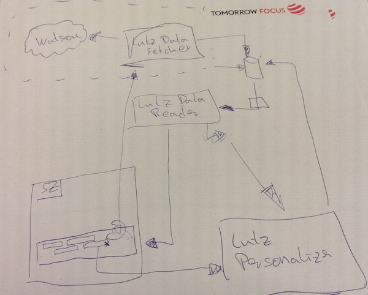

# Futurelab Hackathon by medialab-bayern


URL: http://medialab-bayern.de/futurelab/
SZ Feed: http://www.sueddeutsche.de/service/updates-mit-rss-uebersicht-aller-rss-feeds-fuer-szde-sz-magazin-und-jetztde-1.393950
IBM Watson: https://console.ng.bluemix.net/catalog/?category=watson

Architecture idea:



The directory `GetStartedTomcat` contains Lutz-Data-Fetcher prototype.
The repo  contains the [Lutz-Data-Reader](https://github.com/FQ400/nodejs-cloudantdb-crud-example).


BrowserExtension Bookmarklet:

```
javascript:(function()%7B%0Avar%20lutzReaderUrl%20%3D%20%27https%3A%2F%2Flutz-data-reader.eu-gb.mybluemix.net%2Furl%3Furl%3D%27%20%2B%20location.href%3B%0A%0Avar%20lutzStyle%20%3D%20document.createElement(%27style%27)%3B%0AlutzStyle.type%20%3D%20%27text%2Fcss%27%3B%0AlutzStyle.rel%20%3D%20%27stylesheet%27%3B%0AlutzStyle.id%20%3D%20%27kx-style-sheet%27%3B%0Adocument.head.appendChild(lutzStyle)%3B%0A%0AlutzStyle.sheet.insertRule(%22.lutz-like%20%7Bbackground%3A%20green!important%7D%22%2C0)%3B%0AlutzStyle.sheet.insertRule(%22.lutz-dislike%20%7Bbackground%3A%20red!important%7D%22%2C1)%3B%0A%0Avar%20generateTags%20%3D%20function(tags)%20%7B%0A%20%20%20%20var%20htmlArray%20%3D%20%5B%27%3Cdiv%20style%3D%22height%3A400px%3B%20position%3Arelative%3B%22%3E%27%5D%3B%0A%0A%20%20%20%20htmlArray.push(%27%3Ciframe%20src%3D%22http%3A%2F%2Fgraphicornothing.com%2Flutz%2F%22%20style%3D%22width%3A300px%3Bheight%3A400px%3B%20float%3Aleft%3B%22%3E%3C%2Fiframe%3E%27)%3B%0A%20%20%20%20htmlArray.push(%27%3Cp%20style%3D%22font-size%3A30px%3B%20line-height%3A%2040px%3Bcolor%3A%20lightgrey%3B%20padding-bottom%3A%2030px%3B%22%3ENenne%20Lutz%2C%20welche%20Themen%20dich%20als%20n%C3%A4chstes%20interessieren%3A%3C%2Fp%3E%27)%3B%0A%20%20%20%20%0A%20%20%20%20tags.forEach(function(el)%20%7B%0A%20%20%20%20%20%20%20htmlArray.push(%27%3Cspan%20class%3D%22lutz-tag%22%20data-state%3D0%20style%3D%22color%3A%20white%3Bbackground%3Alightgrey%3B%20padding%3A15px%3B%20margin%3A5px%3B%20border-radius%3A%2010px%3B%20display%3A%20inline-block%3B%20font-size%3A%2025px%3B%22%3E%27)%0A%20%20%20%20%20%20%20htmlArray.push(el.text)%3B%20%0A%20%20%20%20%20%20%20htmlArray.push(%27%3C%2Fspan%3E%27)%3B%0A%20%20%20%20%7D)%3B%0A%20%20%20%20%0A%20%20%20%20htmlArray.push(%27%3Ca%20style%3D%22font-size%3A20px%3B%20color%3Ablue%3B%20text-align%3Aright%3B%20position%3Aabsolute%3B%20bottom%3A%200%3B%20right%3A%2020px%22%20href%3D%22http%3A%2F%2Flutzdata.eu-gb.mybluemix.net%2Flisa.html%22%3EZur%20pers%C3%B6nlichen%20Tag-Cloud%3C%2Fa%3E%27)%3B%0A%20%20%20%20htmlArray.push(%27%3C%2Fdiv%3E%27)%3B%0A%0A%0A%20%20%20%20return%20htmlArray%3B%0A%7D%3B%0A%0Avar%20likeHandler%20%3D%20function(event)%20%7B%0A%20%20%20%20var%20state%20%3D%20event.target.getAttribute(%27data-state%27)%3B%0A%20%20%20%20if%20(state%20%3D%3D%200)%20%7B%0A%20%20%20%20%20%20%20%20event.target.setAttribute(%27data-state%27%2C%201)%3B%0A%20%20%20%20%20%20%20%20event.target.setAttribute(%27class%27%2C%27lutz-like%27)%3B%0A%20%20%20%20%7D%20else%20if%20(state%20%3D%3D%201)%20%7B%0A%20%20%20%20%20%20%20%20event.target.setAttribute(%27data-state%27%2C%202)%3B%0A%20%20%20%20%20%20%20%20event.target.setAttribute(%27class%27%2C%27lutz-dislike%27)%3B%0A%20%20%20%20%7D%20else%20%7B%0A%20%20%20%20%20%20%20%20event.target.setAttribute(%27data-state%27%2C%200)%3B%0A%20%20%20%20%20%20%20%20event.target.setAttribute(%27class%27%2C%27%27)%3B%0A%20%20%20%20%7D%0A%7D%3B%0A%0Afunction%20placeTags(strArray)%20%7B%0A%20%20%20%20var%20footer%20%3D%20document.querySelector(%27.article-footer%27)%3B%0A%20%20%20%20var%20div%20%3D%20document.createElement(%27div%27)%3B%0A%0A%20%20%20%20div.innerHTML%20%3D%20strArray.join(%27%27)%3B%0A%20%20%20%20document.querySelector(%27%23article-body%27).insertBefore(div%2C%20footer)%3B%0A%7D%0A%0Avar%20getTags%20%3D%20fetch(lutzReaderUrl%2C%20%7B%20method%3A%20%27get%27%20%7D)%3B%0A%0AgetTags.then(function(resp)%20%7B%0A%20%20%20%20return%20resp.json()%3B%0A%7D)%0A.then(function(tags)%7B%0A%20%20%20%20%20%20%20%20if(tags)%20%7B%0A%20%20%20%20%20%20%20%20%20%20%20%20strArray%20%3D%20generateTags(tags)%3B%0A%20%20%20%20%20%20%20%20%20%20%20%20placeTags(strArray)%3B%0A%0A%20%20%20%20%20%20%20%20%20%20%20%20var%20tagEls%20%3D%20Array.prototype.slice.call(document.querySelectorAll(%27.lutz-tag%27))%3B%0A%20%20%20%20%20%20%20%20%20%20%20%20%0A%20%20%20%20%20%20%20%20%20%20%20%20tagEls.forEach(function(el)%20%7B%20%0A%20%20%20%20%20%20%20%20%20%20%20%20%20%20%20%20el.onclick%20%3D%20likeHandler%3B%0A%20%20%20%20%20%20%20%20%20%20%20%20%7D)%3B%20%20%20%0A%20%20%20%20%20%20%20%20%7D%0A%7D)%0A.catch(function(err)%20%7B%0A%20%20%20%20console.log(%27ERR%27%2C%20err)%3B%0A%7D)%3B%0A%0A%7D)()%3B
```
